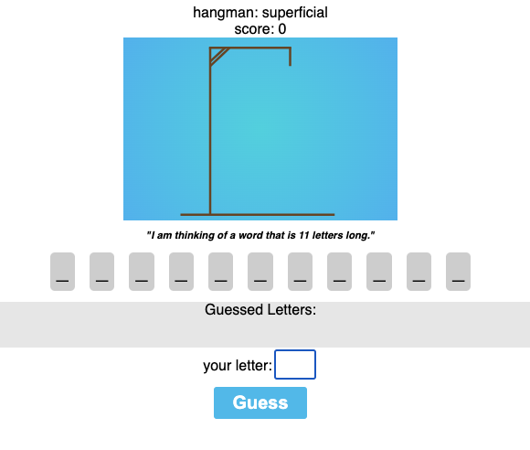

# Hangman

To Check out a running version here: 
[CodeSandBox](https://codesandbox.io/p/github/BoOppenheimer/35-react-hangman/master?file=/src/App.js:1,1)

## possiable other features

- [ ] click and show definition of word?
- [ ] show simular meaning words? Theasauras?...
- [ ] Perhaps the words can be coming from a crossword puzzle api? Or dictonary api?
